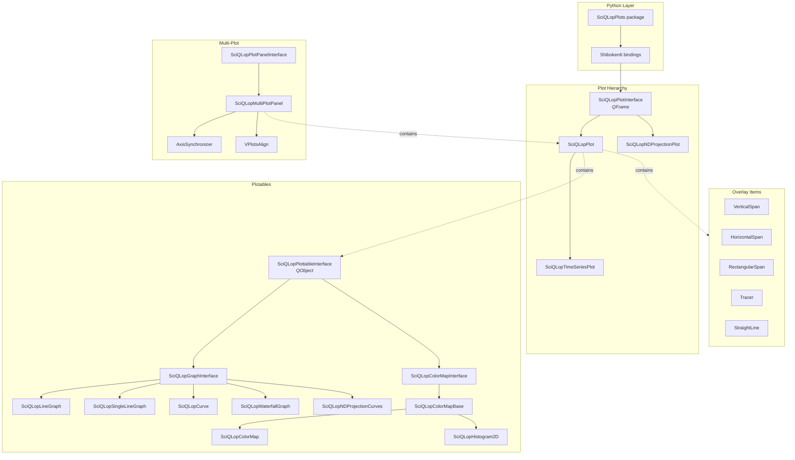
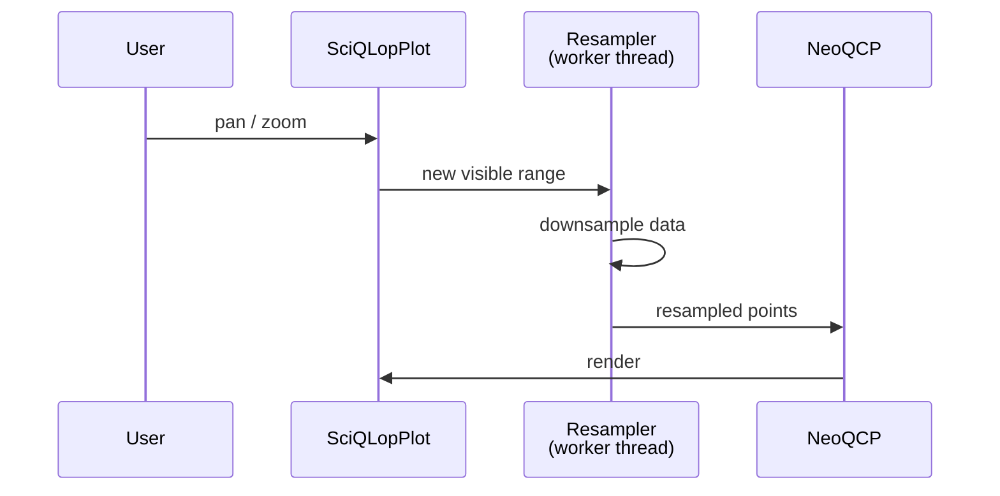

[](https://www.gnu.org/licenses/gpl-3.0)
[]()
[](https://pypi.python.org/pypi/sciqlopplots)
[](https://codecov.io/gh/SciQLop/SciQLopPlots/branch/main)

# SciQLopPlots

A high-performance scientific plotting library built on C++20/Qt6 with Python bindings via Shiboken6 (PySide6). Designed for the [SciQLop](https://github.com/SciQLop/SciQLop) data analysis platform but usable standalone.

## Features

- **Async resampling** — render millions of points smoothly; data is downsampled in background threads via [NeoQCP](https://github.com/SciQLop/NeoQCP) pipelines
- **Multiple plot types** — time series (line graphs), spectrograms (color maps), 2D histograms, parametric curves, N-D projection curves, waterfall plots
- **Interactive** — pan, zoom, data-driven callbacks, vertical/horizontal/rectangular spans, tracers, straight lines, text, shapes, pixmaps
- **Multi-plot panels** — synchronized axes, aligned margins, drag-and-drop from product trees
- **Reactive pipelines** — connect plot properties with `>>` to build live data flows
- **Export** — PDF (vector), PNG, JPG, BMP for both individual plots and panels
- **Busy indicator** — visual feedback when data is loading or being processed
- **Runtime inspector** — tree model/view for inspecting and editing plot properties
- **Cross-platform** — Linux, macOS, Windows

## Architecture



### Data flow



For callback-driven data, the plot invokes a Python callable with `(start, stop)` on range change, and the returned arrays flow through the same resampling pipeline.

## Quick start

```bash
pip install SciQLopPlots
```

```python
import numpy as np
from PySide6.QtWidgets import QApplication
from SciQLopPlots import SciQLopPlot

app = QApplication([])
plot = SciQLopPlot()

# Static data
x = np.arange(0, 1000, dtype=np.float64)
y = np.sin(x / 100) * np.cos(x / 10)
plot.plot(x, y, labels=["signal"])

# Data callback (called on pan/zoom with visible range)
def get_data(start, stop):
    x = np.arange(start, stop, dtype=np.float64)
    y = np.column_stack([np.sin(x / 100), np.cos(x / 100)])
    return x, y

plot.plot(get_data, labels=["sin", "cos"])

plot.show()
app.exec()
```

### Reactive pipelines

Connect plot properties with the `>>` operator to build live data pipelines:

```python
from SciQLopPlots import SciQLopPlot

plot = SciQLopPlot()
graph = plot.plot(lambda start, stop: ..., labels=["signal"])

# Axis range changes automatically feed a transform, which pushes data to the graph
plot.x_axis.on.range >> get_data >> graph.on.data

# Direct property forwarding (no transform)
span.on.range >> plot.x_axis.on.range

# Chain multiple steps
source.on.range >> transform >> target.on.data
```

Run the gallery for a full feature showcase:

```bash
python tests/manual-tests/gallery.py
```

## Runtime tracing

SciQLopPlots ships with a built-in tracer that emits Chrome trace JSON, viewable in
[Perfetto](https://ui.perfetto.dev/), [Speedscope](https://www.speedscope.app/), or
`chrome://tracing`. Always compiled in, runtime-toggled, ~1 ns when off.

Enable for a session, then open the file in Perfetto:

```python
from SciQLopPlots import tracing

with tracing.session("/tmp/sciqlop.json"):
    panel.zoom_in_a_lot()       # whatever's slow
```

Annotate Python work to land alongside the C++ zones (`plot.replot`,
`setdata.colormap`, `resample.async_2d`, …):

```python
with tracing.zone("speasy.fetch", cat="data", product="amda/mms_fgm"):
    data = speasy.get_data(...)

@tracing.traced("layer.eval", cat="layer")
def render_layer(...): ...

tracing.counter("queue_depth", q.size(), cat="fetch")
```

You can also auto-enable at process start with the `SCIQLOP_TRACE` env var:

```bash
SCIQLOP_TRACE=/tmp/sciqlop.json python my_script.py
```

When `tracy_enable=true` is also passed at build time, the same `PROFILE_HERE_N`
sites feed both the Chrome JSON tracer and the Tracy live-streaming view.

## Building from source

Requires Qt6, PySide6 == 6.11.0, a C++20 compiler, and Meson.

```bash
# Development build (recommended — plain `debug` disables optimizations
# and makes the resampling pipelines noticeably sluggish)
meson setup build --buildtype=debugoptimized
meson compile -C build

# Install as editable Python package
pip install -e . --no-build-isolation
```

### Build options

| Option | Type | Default | Description |
|---|---|---|---|
| `trace_refcount` | bool | false | Enable reference count tracing |
| `tracy_enable` | bool | false | Enable Tracy profiling |
| `with_opengl` | bool | true | Enable OpenGL support |

## Contributing

Fork the repository, make your changes and submit a pull request.
Bug reports and feature requests are welcome.

## Credits

Development is supported by [CDPP](http://www.cdpp.eu/).
We acknowledge support from [Plas@Par](https://www.plasapar.sorbonne-universite.fr).

## Thanks

- [PySide6](https://doc.qt.io/qtforpython-6/index.html) — Qt bindings and Shiboken6 binding generator
- [NeoQCP](https://github.com/SciQLop/NeoQCP) — fork of [QCustomPlot](https://www.qcustomplot.com/) with async pipelines, multi-dtype support, and QRhi rendering
