# SciQLopPlots user guide

SciQLopPlots draws scientific plots in Qt applications. It is fast with big data: millions of points pan and zoom smoothly, because a background thread downsamples what you see.

It is a normal Qt widget library. Use it from Python (PySide6) in a script, a notebook-launched window, or your own application.

This guide goes from a first plot to live data, multi-plot panels, overlays and export. Every Python snippet in it is run by the test suite (`tests/integration/test_user_guide.py`), so it matches the installed library.

- [Install](#install)
- [Your first plot](#your-first-plot)
- [Put a plot in your own window](#put-a-plot-in-your-own-window)
- [Plot types](#plot-types)
- [Live data: plot a function](#live-data-plot-a-function)
- [Time series](#time-series)
- [Several plots in a panel](#several-plots-in-a-panel)
- [Axes](#axes)
- [Colours, names and themes](#colours-names-and-themes)
- [Overlays: spans, lines and text](#overlays-spans-lines-and-text)
- [Reactive pipelines](#reactive-pipelines)
- [N-D projections](#n-d-projections)
- [Export](#export)
- [Performance tips](#performance-tips)
- [Troubleshooting](#troubleshooting)

## Install

```bash
pip install SciQLopPlots
```

This pulls in PySide6 and NumPy. Wheels exist for Linux, macOS and Windows.

## Your first plot

```python
import sys
import numpy as np
from PySide6.QtWidgets import QApplication
from SciQLopPlots import SciQLopPlot

app = QApplication(sys.argv)

x = np.linspace(0, 10, 1000)
plot = SciQLopPlot()
plot.plot(x, np.sin(x), labels=["sin"])
plot.show()

app.exec()
```

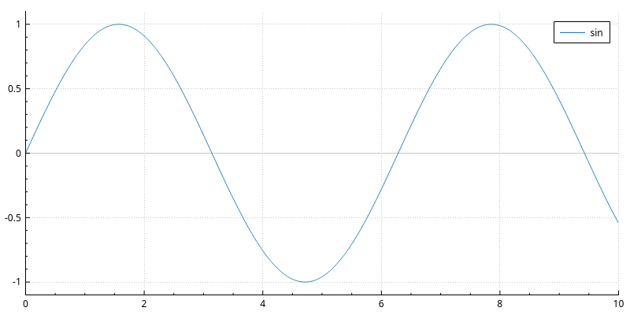

Three things to know:

1. **A `QApplication` must exist first.** Create it once, before any plot. Qt needs it for every widget.
2. **`plot()` returns a graph object.** Keep it if you want to change the data or style later.
3. **`app.exec()` runs the window** until you close it. In an application you already have, skip it.

Mouse controls:

| Action | Effect |
|---|---|
| Drag | pan |
| Wheel | scroll along x |
| Ctrl + wheel | zoom x |
| Shift + wheel | zoom y |
| Ctrl + Shift + wheel | scroll along y |
| Wheel over an axis | zoom that axis only |
| Wheel over the colour scale | zoom the colour range |

## Put a plot in your own window

A plot is a `QWidget`. Put it in any layout, like a button or a label.

```python
import sys
import numpy as np
from PySide6.QtWidgets import QApplication, QMainWindow, QWidget, QVBoxLayout, QPushButton
from SciQLopPlots import SciQLopPlot

app = QApplication(sys.argv)

window = QMainWindow()
central = QWidget()
layout = QVBoxLayout(central)

plot = SciQLopPlot()
x = np.linspace(0, 10, 1000)
graph = plot.plot(x, np.sin(x), labels=["signal"])

button = QPushButton("Cosine")
button.clicked.connect(lambda: graph.set_data(x, np.cos(x)))

layout.addWidget(plot)
layout.addWidget(button)
window.setCentralWidget(central)
window.resize(800, 500)
window.show()

app.exec()
```

`graph.set_data(x, y)` replaces the data at any time. The plot redraws by itself.

## Plot types

`plot.plot(...)` picks the graph type from its arguments. Pass `graph_type=` to choose another one.

| You pass | You get | `graph_type` |
|---|---|---|
| `x, y` with `y` of shape `(n,)` or `(n, k)` | line graph, `k` lines | `GraphType.Line` (default) |
| `x, y` | markers only | `GraphType.Scatter` |
| `x, y, z` | colour map (spectrogram) | `GraphType.ColorMap` (implied) |
| `x, y` in any order (orbits, hodograms) | parametric curve | `GraphType.ParametricCurve` |
| `x, y` with `y` of shape `(n, k)` | `k` stacked traces | `GraphType.Waterfall` |
| `x, y` scatter points | 2-D density histogram | `GraphType.Histogram2D` |

`x` must be `float64`. Values (`y`, `z`) can be any numeric dtype: `float32`, integers, etc. They are read in place, without a copy.

### Lines

```python
import numpy as np
from PySide6.QtGui import QColorConstants
from SciQLopPlots import SciQLopPlot

plot = SciQLopPlot()
x = np.linspace(0, 10, 100_000)
y = np.column_stack([np.sin(x), np.cos(x), np.sin(2 * x)])  # 3 lines
graph = plot.plot(x, y, labels=["sin", "cos", "sin 2x"],
                  colors=[QColorConstants.Red, QColorConstants.Blue, QColorConstants.DarkGreen])
```

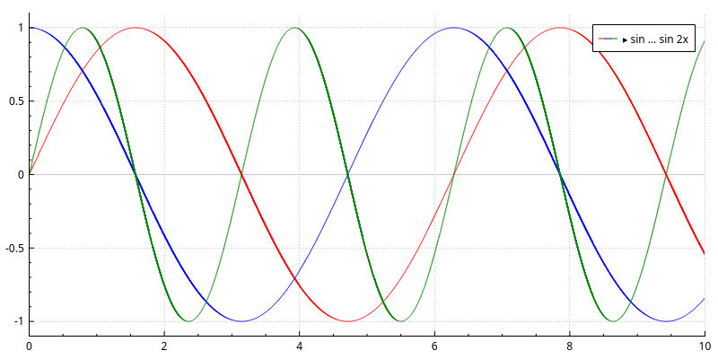

A 2-D `y` gives one line per column. `labels` names them in the legend, and `colors` sets their colours. Both are optional.

### Scatter

```python
import numpy as np
from SciQLopPlots import SciQLopPlot, GraphType

plot = SciQLopPlot()
rng = np.random.default_rng(0)
x = np.sort(rng.uniform(0, 10, 500))
plot.plot(x, np.sin(x) + rng.normal(0, 0.1, 500), graph_type=GraphType.Scatter, labels=["noisy"])
```

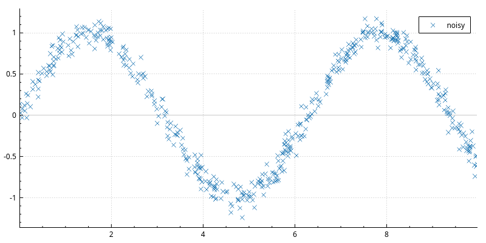

### Colour maps (spectrograms)

```python
import numpy as np
from SciQLopPlots import SciQLopPlot, ColorGradient

plot = SciQLopPlot()
x = np.linspace(0, 100, 400)          # e.g. time, shape (nx,)
y = np.logspace(0, 3, 64)             # e.g. energy, shape (ny,)
z = np.outer(np.sin(x / 10) + 2, 1 / y)   # shape (nx, ny): z[i, j] is at (x[i], y[j])

cmap = plot.plot(x, y, z, name="spectrogram")
cmap.set_gradient(ColorGradient.Viridis)
cmap.set_y_log_scale(True)
cmap.set_z_log_scale(True)
```

`z` has one row per `x` value and one column per `y` value. `y` may also have `z`'s shape, when the y channels change over time (a varying energy table, for example).

On a log colour scale, pixels that cover several samples are averaged in log space. So zoomed-out spectrograms look like the zoomed-in ones.

### Parametric curves

For data where `x` goes back and forth, like an orbit or a hodogram:

```python
import numpy as np
from SciQLopPlots import SciQLopPlot, GraphType

plot = SciQLopPlot()
t = np.linspace(0, 12 * np.pi, 5000)
r = np.exp(np.cos(t)) - 2 * np.cos(4 * t)
plot.plot(r * np.sin(t), r * np.cos(t), graph_type=GraphType.ParametricCurve, labels=["butterfly"])
plot.rescale_axes()
```

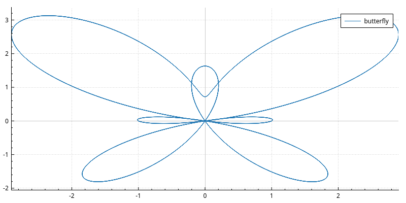

### Waterfall

Stacks each column of `y` with an offset, for channel stacks or seismic-style record sections:

```python
import numpy as np
from SciQLopPlots import SciQLopPlot, GraphType

plot = SciQLopPlot()
t = np.linspace(0, 10, 2000)
y = np.column_stack([np.sin(2 * np.pi * (0.5 + 0.3 * i) * t) for i in range(8)])
wf = plot.plot(t, y, graph_type=GraphType.Waterfall,
               offsets=2.5,        # spacing between traces, or one offset per trace
               normalize=True,     # scale each trace to the same height
               gain=1.0,
               labels=[f"ch{i}" for i in range(8)])
wf.set_gain(2.0)   # change it later; the plot follows
```

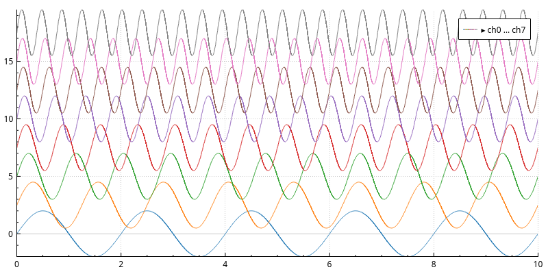

### 2-D histograms

Bins scattered points into a density map:

```python
import numpy as np
from SciQLopPlots import SciQLopPlot

plot = SciQLopPlot()
rng = np.random.default_rng(42)
x, y = rng.normal(0, 1, 100_000), rng.normal(0, 0.5, 100_000)
hist = plot.add_histogram2d("density", 80, 80)   # name, x bins, y bins
hist.set_data(x, y)
plot.x_axis().set_range(-4, 4)
plot.y_axis().set_range(-2, 2)
```

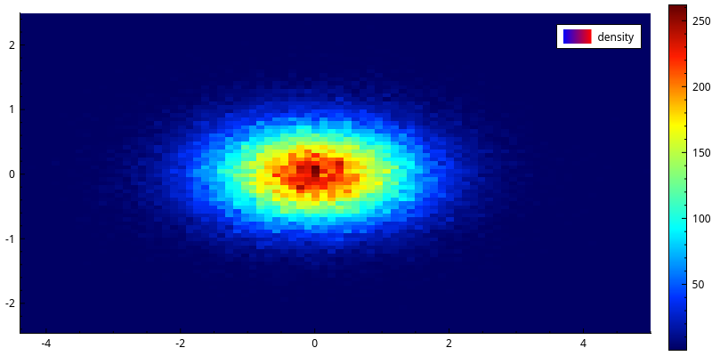

## Live data: plot a function

Instead of arrays, give `plot()` a function. It receives the visible range as `(start, stop)` and returns the data for it. On every pan or zoom, it is called again for the new range.

This is how you plot data that is too big to load at once, or that comes from a server.

```python
import numpy as np
from SciQLopPlots import SciQLopPlot

def get_data(start, stop):
    x = np.linspace(start, stop, 10_000)
    return x, np.column_stack([np.sin(x), np.cos(x)])

plot = SciQLopPlot()
graph = plot.plot(get_data, labels=["sin", "cos"])
plot.x_axis().set_range(0, 100)   # triggers a call with (0, 100)
```

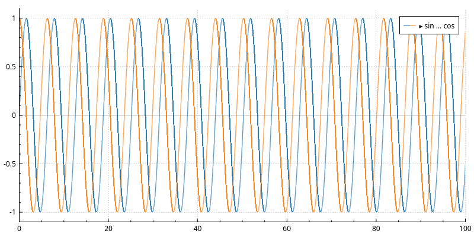

What the function may return:

- `x, y`: line graph data, as for static plots. Return `x, y, z` for a colour map (use `graph_type=GraphType.ColorMap`).
- `{"data": [x, y], "color": c}`: the same, plus one colour value per sample, to colour the line by a third quantity.
- `None` or empty arrays: nothing to show for that range.

Things to know:

- **It runs in a background thread**, so the window stays responsive while it works. Don't touch widgets from it; just compute and return arrays.
- **Calls are coalesced.** A fast drag does not queue up hundreds of calls; only the latest range is fetched.
- **`graph.busy()`** is true while a fetch is in flight. When it lasts more than half a second, the graph fades slightly as a hint.
- **The same range is not fetched twice.** If your source changed (new parameters, fresh data), call `graph.invalidate_cache()` and the next request fetches again.

### Fetch a margin around the view

By default each request asks exactly for the visible range, so a small pan fetches everything again. If your function returns the same data for a range whatever the span asked (raw samples from a file or a server), let it fetch a margin:

```python
import numpy as np
from SciQLopPlots import SciQLopPlot

def raw_samples(start, stop):
    x = np.arange(np.floor(start), np.ceil(stop), 0.01)
    return x, np.sin(x)

plot = SciQLopPlot()
graph = plot.plot(raw_samples, labels=["raw"])
graph.set_prefetch_margin(0.5)   # fetch the view plus half its width on each side
```

Then pans and zooms that stay inside what was loaded cost nothing. Leave the margin at 0 for functions whose answer depends on the span: one that always returns 1000 points, for example, would stay coarse after a zoom-in.

### Colour a line by a third quantity

```python
import numpy as np
from SciQLopPlots import SciQLopPlot, ColorGradient

plot = SciQLopPlot()
x = np.linspace(0, 10, 2000)
graph = plot.plot(x, np.sin(x), labels=["sin"])
graph.set_color_data(np.cos(x), ColorGradient.Plasma)   # one value per x sample
```

The plot shows a colour scale for it. Pass an empty array to go back to a plain line.

A data function can send the colour values with each batch:

```python
import numpy as np
from SciQLopPlots import SciQLopPlot, ColorGradient

def speed_coloured(start, stop):
    x = np.linspace(start, stop, 5000)
    return {"data": [x, np.sin(x)], "color": np.abs(np.cos(x))}

plot = SciQLopPlot()
graph = plot.plot(speed_coloured, labels=["position"])
graph.set_color_gradient(ColorGradient.Turbo)
plot.x_axis().set_range(0, 20)
```

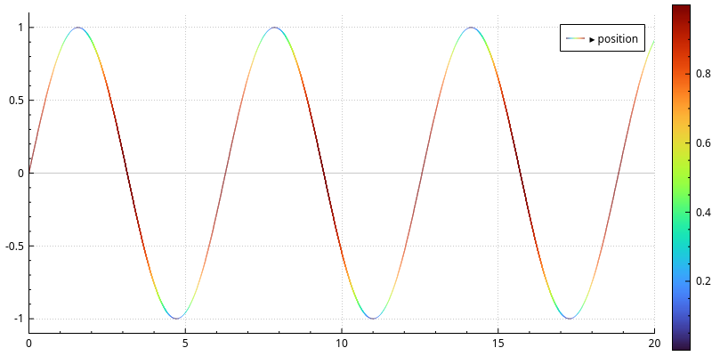

## Time series

For time on the x axis, use seconds since 1970-01-01 UTC (Unix time) as `float64`. Then ask for a time series plot: the x axis shows dates and times.

```python
from datetime import datetime, timezone
import numpy as np
from SciQLopPlots import SciQLopTimeSeriesPlot, SciQLopPlotRange

start = datetime(2025, 4, 12, tzinfo=timezone.utc).timestamp()
t = start + np.arange(0, 86400, 4.5)                       # one day, 4.5 s cadence
plot = SciQLopTimeSeriesPlot()
plot.x_axis().set_range(SciQLopPlotRange(start, start + 3 * 3600))   # first 3 hours
plot.plot(t, np.sin(2 * np.pi * (t - start) / 3600), labels=["hourly wave"])
```

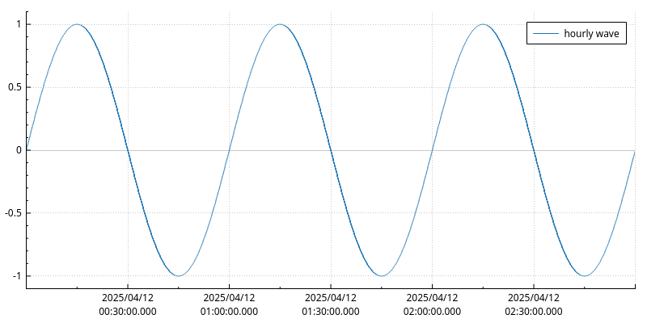

A time series plot never moves its time axis by itself: you choose the time range. It fits the y axis to the data in that range, so set the range first, or call `plot.y_axis().rescale()` after changing it.

With NumPy `datetime64` data, convert first: `t = times.astype("datetime64[ns]").astype(np.int64) / 1e9`.

## Several plots in a panel

`SciQLopMultiPlotPanel` stacks plots vertically and keeps their x (or time) axes in sync. It's the usual layout for comparing several quantities over the same time range.

```python
from datetime import datetime, timezone
import numpy as np
from SciQLopPlots import SciQLopMultiPlotPanel, PlotType

def magnetic_field(start, stop):
    t = np.arange(start, stop, 1.0)
    return t, np.column_stack([np.sin(t / 600), np.cos(t / 600), np.sin(t / 300)])

def density(start, stop):
    t = np.arange(start, stop, 4.0)
    return t, 5 + np.sin(t / 1800)

panel = SciQLopMultiPlotPanel(synchronize_x=False, synchronize_time=True)
b_plot, b_graph = panel.plot(magnetic_field, labels=["Bx", "By", "Bz"], plot_type=PlotType.TimeSeries)
n_plot, n_graph = panel.plot(density, labels=["N"], plot_type=PlotType.TimeSeries)

start = datetime(2025, 4, 12, tzinfo=timezone.utc).timestamp()
panel.set_time_axis_range(start, start + 6 * 3600)   # every plot follows
```

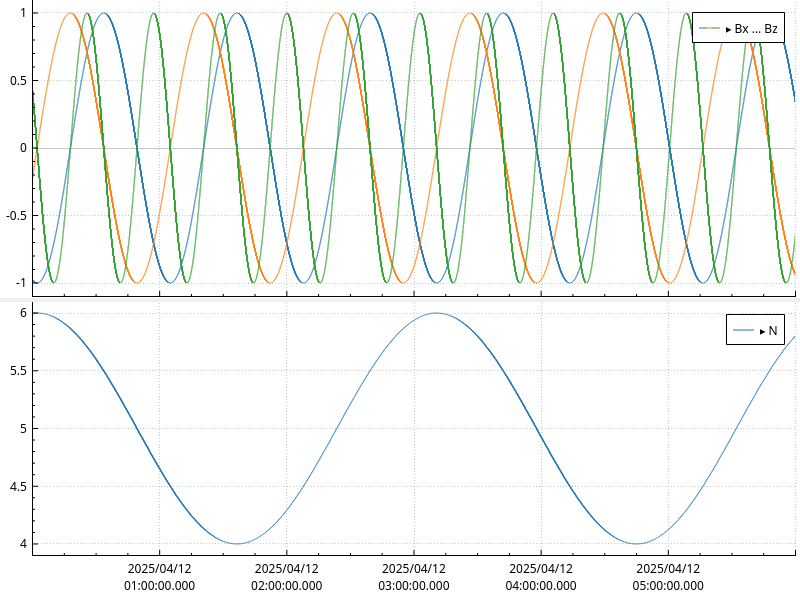

- On a panel, **`plot()` returns `(plot, graph)`**: the new plot and the graph in it.
- **`synchronize_time=True`** links the time axes of time series plots. **`synchronize_x=True`** links plain x axes instead.
- `panel.plot_at(i)`, `panel.plots()` and `panel.plot_count()` give access to the plots.

To add a graph to an existing plot of the panel, call `plot()` on that plot instead of on the panel.

## Axes

Each plot has `x_axis()`, `y_axis()`, a second pair `x2_axis()` / `y2_axis()` (top and right), and `z_axis()` for colour scales.

```python
import numpy as np
from SciQLopPlots import SciQLopPlot

plot = SciQLopPlot()
x = np.linspace(1, 1000, 1000)
plot.plot(x, x ** 2, labels=["x²"])

plot.x_axis().set_label("distance [km]")
plot.y_axis().set_label("area [km$^2$]")   # $...$ is rendered as LaTeX
plot.y_axis().set_log(True)
plot.x_axis().set_range(1, 1000)
plot.y_axis().rescale()                      # fit the data on this axis
r = plot.x_axis().range()
print(r.start(), r.stop(), r.size())
```

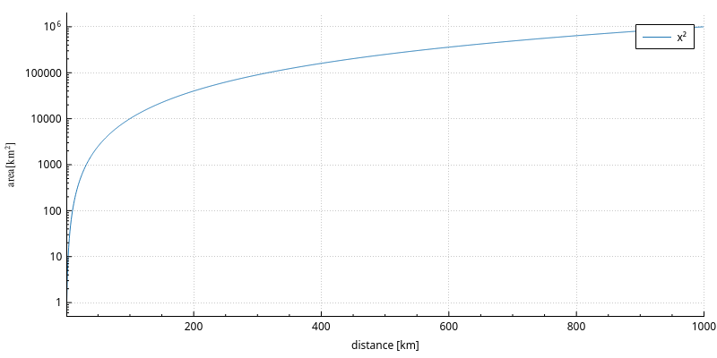

- `plot.rescale_axes()` fits every axis to the data.
- Rescaling leaves a 5% margin on each side of a value axis, so ticks at the data's ends (0/1 flags, enum levels) keep their labels. `axis.set_autoscale_margin(0.1)` changes it at runtime (0 to 0.5; in decades on a log axis), and so does the axis's inspector panel. Time axes, key axes and axes holding a colormap or histogram are never padded.
- `axis.set_min_range_size(s)` / `set_max_range_size(s)` limit how far a user can zoom.

## Colours, names and themes

```python
import numpy as np
from PySide6.QtGui import QColorConstants
from SciQLopPlots import SciQLopPlot, SciQLopTheme, ColorGradient

plot = SciQLopPlot()
x = np.linspace(0, 10, 100)
graph = plot.plot(x, np.column_stack([np.sin(x), np.cos(x)]), labels=["a", "b"])

graph.set_labels(["sine", "cosine"])                   # legend names
graph.set_colors([QColorConstants.Magenta, QColorConstants.Cyan])
graph.set_name("trig")                                 # the graph's own name
plot.set_theme(SciQLopTheme.dark(plot))                # or SciQLopTheme.light(plot)
plot.set_z_gradient(ColorGradient.Cividis)             # gradient for colour-coded data
```

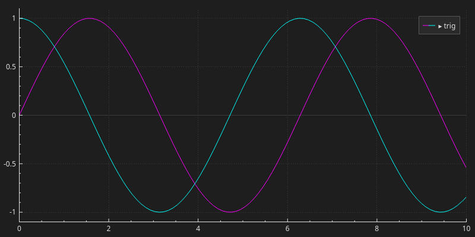

Available gradients (`ColorGradient`): Viridis, Cividis, Magma, Inferno, Plasma and Turbo (perceptually uniform, colour-blind friendly), Coolwarm (diverging), plus the classic Jet, Hot, Cold, Grayscale, Spectrum, Thermal, Polar, Hues, Candy, Ion, Night and Geography.

A panel takes a theme too: `panel.set_theme(SciQLopTheme.dark(panel))`.

## Overlays: spans, lines and text

```python
import numpy as np
from PySide6.QtCore import QPointF
from PySide6.QtGui import QColor
from SciQLopPlots import (SciQLopPlot, SciQLopPlotRange, SciQLopVerticalSpan,
                          SciQLopHorizontalLine, SciQLopTextItem, Coordinates)

plot = SciQLopPlot()
x = np.linspace(0, 10, 1000)
plot.plot(x, np.sin(x), labels=["sin"])

# A shaded x interval the user can drag and resize
span = SciQLopVerticalSpan(plot, SciQLopPlotRange(2.0, 4.0), QColor(100, 100, 220, 80),
                           read_only=False, visible=True, tool_tip="event")
span.range_changed.connect(lambda r: print("span now", r.start(), r.stop()))

# A threshold line at y = 0.5
threshold = SciQLopHorizontalLine(plot, 0.5)

# A text label placed in data coordinates
note = SciQLopTextItem(plot, "peak", QPointF(1.57, 1.0), False, Coordinates.Data)
```

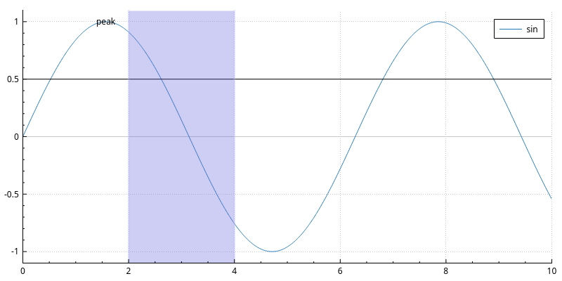

- On a panel, `MultiPlotsVerticalSpan(panel, range, color, ...)` draws one span across every plot. That's handy for marking an event in time. Read and set its state as attributes: `span.selected = True`, `span.visible`, `span.color`, `span.read_only`, `span.id`.
- `SciQLopVerticalLine`, `SciQLopRectangularSpan`, `SciQLopEllipseItem` and `SciQLopPixmapItem` follow the same pattern.

`MultiPlotsVerticalLine` draws one vertical line across every plot of a panel, including plots added later. It makes a good time cursor:

```python
import numpy as np
from PySide6.QtGui import QColor
from SciQLopPlots import SciQLopMultiPlotPanel, MultiPlotsVerticalLine

panel = SciQLopMultiPlotPanel()
x = np.linspace(0, 10, 1000)
panel.plot(x, np.sin(x), labels=["sin"])
panel.plot(x, np.cos(x), labels=["cos"])

cursor = MultiPlotsVerticalLine(panel, 2.0, tool_tip="cursor")
cursor.position_changed.connect(lambda t: print("cursor at", t))
cursor.position = 5.0          # moves it on every plot
cursor.color = QColor("red")   # also line_width, visible, read_only, tooltip
```

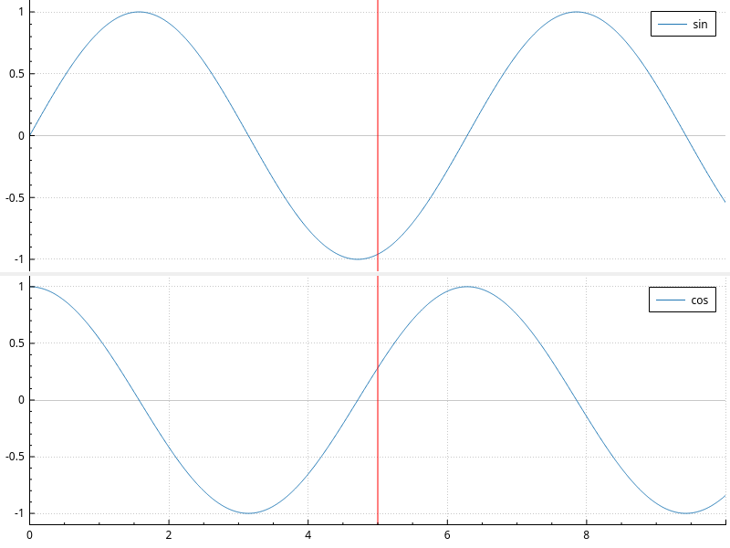

Dragging the line on any plot moves it on all of them, and `position_changed` fires once per move. With `read_only=True` the user can't drag it.

## Interval timelines

A timeline shows intervals — events, instrument modes, catalog entries — as coloured bars on named lanes. `panel.add_timeline()` gives a compact, dedicated plot for them:

```python
import numpy as np
from PySide6.QtGui import QColor
from SciQLopPlots import SciQLopMultiPlotPanel

panel = SciQLopMultiPlotPanel(synchronize_time=True)
plot, tl = panel.add_timeline()

start = np.array([0, 3600, 9000], dtype=np.float64)
stop = np.array([1800, 7200, 10800], dtype=np.float64)
tl.set_intervals(start, stop, lane=["MSA", "MGF", "MSA"],
                 category=["LM", "survey", "burst"],
                 label=["low mass", "survey mode", "burst mode"])
tl.set_category_colors({"LM": QColor("#f59e0b"), "survey": QColor("#3b82f6")})
panel.set_time_axis_range(0, 12000)
```

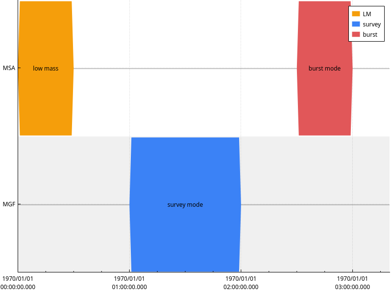

- `panel.add_timeline()` returns `(plot, timeline)`: a time-series plot sized to its lanes, and the timeline plottable to feed. `lane_height` (22 px by default) is a minimum: make the plot taller and the lanes grow with it. `panel.organize_plots()` gives timeline plots their natural height and shares the rest.
- `set_intervals(start, stop, lane=..., category=..., label=..., ids=...)` takes epoch seconds or `datetime64` arrays; a missing `stop` defaults to `start`. Lane and category names are kept in first-seen order.
- Timelines are drawn like a logic analyzer's wave view: bus-shaped bars with angled ends, an idle line through each lane, and every other lane shaded. Labels are centred in the visible part of each bar and shortened with "…" when they don't fit. `tl.style = "bars"` switches to plain bars.
- `tl.lanes` reads the displayed lanes; `tl.lanes = [...]` reorders them or hides the ones left out. `tl.rename_lane(old, new)` renames one; `tl.count()` gives the number of intervals. Category colours are shared by every timeline: `tl.category_color("LM")` reads one back. The legend lists the categories in use, each with its colour.
- Overlapping intervals in one lane:
  - `tl.stack = None` (the default) draws them over each other.
  - `tl.stack = "time"` puts each in the first free sub-row; good for overlapping events.
  - `tl.stack = "category"` gives each category its own fixed sub-row, named at its start, so an instrument's modes keep their rows from one orbit to the next. `tl.category_order = ["BASE", "HKM", "LM"]` sets the row order; categories left out follow, first seen first.
  - Each sub-row is a full `lane_height`, so a lane with 4 modes is 4 rows tall. For about 70 rows on a 1080 px screen, use `lane_height=14`; below about 12 px, labels no longer fit in their bars.
  - `tl.forbid_overlap = True` makes edits stop at the neighbouring block in the same row, so they never overlap: the same lane, or the same lane and category with `stack="category"`. A move of several selected blocks is limited by the tightest one, and a block moves to another lane only if it fits where it is dropped.
- Timelines show up in the inspector, as "timeline" or their name (`tl.set_name(...)`). Their properties panel sets the style, stacking, forbidden overlaps, lane height, editing and snapping.

A timeline also works as a strip on a regular plot, stacked next to the data:

```python
import numpy as np
from SciQLopPlots import SciQLopTimeSeriesPlot

plot = SciQLopTimeSeriesPlot()
plot.x_axis().set_range(0, 10000)
t = np.linspace(0, 10000, 2000)
plot.plot(t, np.sin(t / 500), labels=["signal"])

strip = plot.add_timeline(lane_height=12)
strip.set_intervals([500, 4000], [3000, 6000], lane=["quiet", "quiet"], category=["ok", "ok"])
```

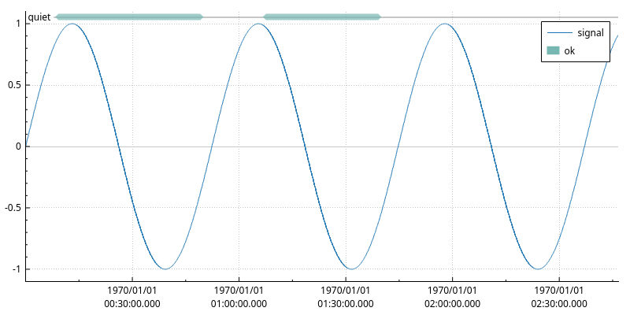

In a strip, lanes keep their `lane_height` and the lane names sit on a small background chip, so the data and the bars never cover them. A line graph added to a timeline plot goes to the right y axis automatically, so the lane names on the left stay readable.

Make a timeline editable to build or adjust a plan by hand, and write edits back into your own data:

```python
import numpy as np
from SciQLopPlots import SciQLopTimeSeriesPlot

plot = SciQLopTimeSeriesPlot()
tl = plot.add_timeline()

plan = {"start": np.array([0.0, 3600.0]), "stop": np.array([1800.0, 7200.0]),
        "lane": ["A", "B"], "ids": np.array([1, 2])}
tl.set_intervals(**plan)

tl.editable = True
tl.edit_modes = {"move", "resize", "change_lane"}
tl.snap_to = 60   # snap drags to the nearest minute; also "edges", a list of times, or None

def apply_edits(edits):
    by_id = {i: (new_start, new_stop, new_lane) for i, new_start, new_stop, new_lane in edits}
    for row, interval_id in enumerate(plan["ids"]):
        if interval_id in by_id:
            plan["start"][row], plan["stop"][row], plan["lane"][row] = by_id[interval_id]
    tl.set_intervals(**plan)   # the single source of truth stays in sync

tl.intervals_changed.connect(apply_edits)
```

- `tl.editable = True` turns on mouse editing. `edit_modes` picks which gestures are allowed (default `{"move", "resize"}`); add `"change_lane"` to let a drag move an interval to another lane, `"create"` to draw new ones on empty lane space, `"delete"` to wire the Delete key to `delete_requested`.
- Drag a block's end to resize it. A block too narrow to grab is resized from just outside its ends; pressing inside it moves it. Instant events (start == stop) only move.
- Shift+drag on empty lane space makes a rubber-band selection; Ctrl-click toggles one interval; arrow keys nudge the selection; Escape cancels a drag in progress.
- `tl.intervals_changed` fires with every edited interval as `[id, start, stop, lane_name]` — the pattern above folds them back into the arrays and calls `set_intervals` again. `tl.interval_created` fires with `(start, stop, lane_name)` when an interval is drawn on empty lane space, and `tl.interval_created_in` with `(start, stop, lane_name, category)`: the category of the row it was drawn in with `stack="category"`, else `""`; `tl.delete_requested` fires with the list of selected ids when Delete or Backspace is pressed. Neither changes the data: add or drop the intervals in your arrays and call `set_intervals` again.
- `tl.snap_to = [t1, t2, ...]` snaps dragged edges to those times only (epoch seconds or `datetime64`), e.g. orbit events.
- `tl.hovered` fires with the hovered interval's id (or `-1` when the mouse leaves it), and `tl.interval(id)` gives its details as a dict: `id`, `start`, `stop`, `duration`, `lane`, `category` and `label` (`None` for an unknown id); `tl.selected_intervals_changed`, `tl.selected_ids()` and `tl.select_ids([...])` track and drive the selection.
- `tl.interval_at(x, y)` gives the id of the interval under a widget pixel, or `None`. The plot's crosshair tooltip lists the hovered interval: lane, label (category), start → stop; `plot.crosshair_text()` returns that tooltip's text.

## Reactive pipelines

Plot objects expose some properties under `.on`. Connect them with `>>` to build live links, optionally through a function.

```python
import numpy as np
from PySide6.QtGui import QColor
from SciQLopPlots import SciQLopPlot, SciQLopVerticalSpan, SciQLopPlotRange

plot = SciQLopPlot()
x = np.linspace(0, 10, 1000)
plot.plot(x, np.sin(x), labels=["sin"])
span = SciQLopVerticalSpan(plot, SciQLopPlotRange(2.0, 4.0), QColor(100, 200, 100, 80),
                           read_only=False, visible=True, tool_tip="")

def describe(event):
    r = event.value
    return f"{r.start():.2f} .. {r.stop():.2f}"

span.on.range >> describe >> span.on.tooltip        # tooltip follows the span

zoomed = SciQLopPlot()
zoomed.plot(x, np.sin(x), labels=["zoom"])
span.on.range >> zoomed.x_axis().on.range           # second plot shows the span's interval
```

The function receives an event whose `.value` is the new value, and returns what to send on; returning `None` sends nothing. Observable properties include:

- `axis.on.range`
- `span.on.range` and `span.on.tooltip`
- `graph.on.data`
- the waterfall settings: `offsets`, `spacing`, `normalize`, `gain`

## N-D projections

`SciQLopNDProjectionPlot` shows a trajectory in several dimensions as side-by-side 2-D projections (X-Y, Y-Z, Z-X for 3 dimensions):

```python
import numpy as np
from SciQLopPlots import SciQLopNDProjectionPlot

t = np.linspace(1.7e9, 1.7e9 + 86400, 5000)            # time, seconds
phase = np.linspace(0, 4 * np.pi, t.size)
x, y, z = np.cos(phase), np.sin(phase), 0.3 * np.sin(2 * phase)

proj = SciQLopNDProjectionPlot(3)
orbit = proj.add_reference_curve([t, x, y, z], label="orbit")   # [time, dims...]
proj.set_axis_labels(["X", "Y", "Z"])
```

When the time comes first, the curves are coloured by time, and a time marker can follow a cursor on another plot. Pass only the dimensions (`[x, y, z]`) to skip that.

## Export

```python
import numpy as np
from SciQLopPlots import SciQLopPlot

plot = SciQLopPlot()
x = np.linspace(0, 10, 1000)
plot.plot(x, np.sin(x), labels=["sin"])

plot.save_png("figure.png", 1200, 800)   # raster, width and height in pixels
plot.save_pdf("figure.pdf")              # vector, current size
```

`save_jpg` and `save_bmp` also exist. Panels export all their plots together: `panel.save_pdf("panel.pdf")`.

## Performance tips

- **Give it everything.** Millions of points are fine: each graph is downsampled to the screen resolution in a background thread. Don't decimate yourself.
- **No need to convert.** `float32` values, integer values and `(n, k)` row-major arrays (NumPy's default) are read in place.
- **Keep data functions lean.** They hold Python's global lock while they run; slow pure-Python loops there slow down every other fetch. Do the heavy work in NumPy or a C extension, which release the lock.
- **Use a prefetch margin** for raw-data sources ([above](#fetch-a-margin-around-the-view)).
- **Profile with the built-in tracer** when something is slow:

```python
import os, tempfile
import numpy as np
from SciQLopPlots import SciQLopPlot, tracing

trace = os.path.join(tempfile.gettempdir(), "sciqlop-trace.json")
with tracing.session(trace):
    plot = SciQLopPlot()
    x = np.linspace(0, 10, 1_000_000)
    plot.plot(x, np.sin(x), labels=["big"])
# open the JSON file in https://ui.perfetto.dev
```

Or set `SCIQLOP_TRACE=/path/trace.json` in the environment to trace a whole run.

## Troubleshooting

**The window never appears, or Qt aborts at start.** Create the `QApplication` before any plot, and call `app.exec()` (or run inside an application that already has an event loop). On a headless machine, set `QT_QPA_PLATFORM=offscreen` for scripts that only export files.

**`Keys (x) must be float64`.** Convert `x` with `x.astype(np.float64)`. For `datetime64`, see [Time series](#time-series).

**The plot is empty.** Check that the axis range covers your data (`plot.rescale_axes()`). For a data function, check it returns arrays for the ranges it is asked, not `None`.

**A data function's changes don't show.** The same range is not fetched twice. Call `graph.invalidate_cache()` after changing what the function returns.

**Something else.** Open an issue at https://github.com/SciQLop/SciQLopPlots/issues with a small script that shows it.
